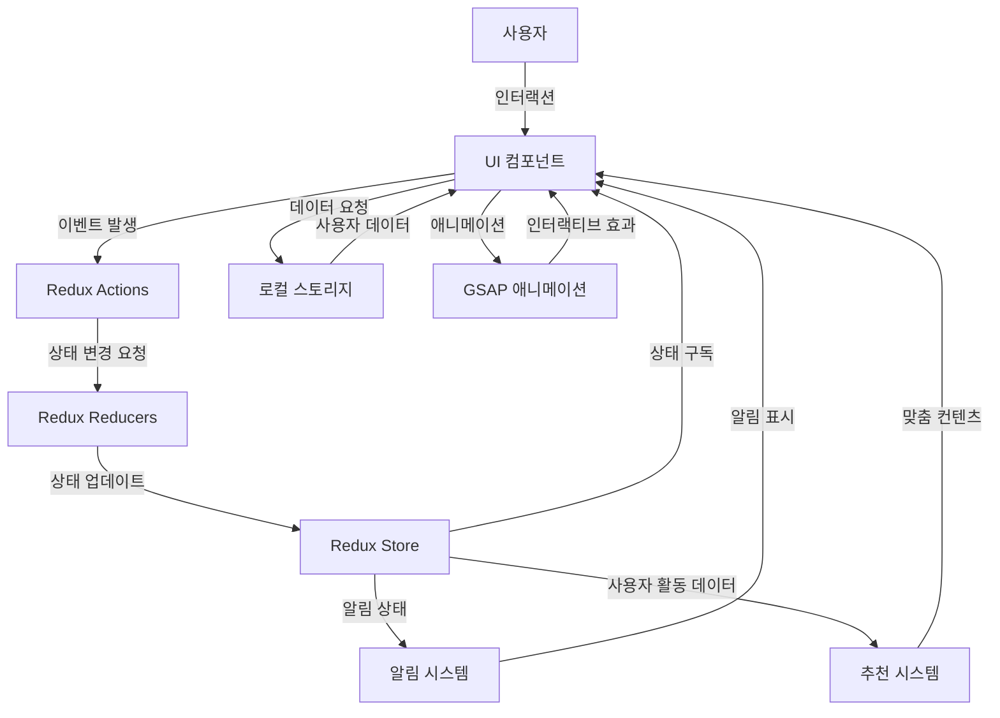

# 📋 Viewee

[](LICENSE)
[](https://github.com/username/repository/stargazers)


## 📝 프로젝트 소개

사용자 취향 분석 알고리즘과 소셜 기능이 결합된 새로운 OTT 경험을 제공합니다. 콘텐츠 추천부터 시청 커뮤니티까지, 단순한 영상 시청을 넘어 콘텐츠와 소통하는 플랫폼입니다.

## ✨ 주요 기능

- **Redux Toolkit을 활용한 상태관리**: 효율적인 상태 관리 시스템으로 애플리케이션 데이터 흐름을 중앙화하여 관리합니다.

- **로컬스토리지를 활용한 사용자 관리**: 로컬스토리지 기반의 로그인, 회원가입, 마이페이지 기능을 통해 사용자 경험을 향상시킵니다.

- **컨텐츠 추천 시스템**: 사용자 활동과 선호도를 기반으로 맞춤형 컨텐츠를 추천해주는 시스템을 구현했습니다.

- **알림 기능**: 실시간 알림 시스템으로 중요한 업데이트와 정보를 사용자에게 즉시 전달합니다.
- **인터렉티브(GSAP)**: GSAP 라이브러리를 활용한 부드럽고 역동적인 인터페이스 애니메이션으로 사용자 상호작용을 향상시킵니다.

## 🛠️ 기술 스택

### 프론트엔드


### 기타 도구


## 📋 시스템 아키텍처



## 🚀 설치 및 실행 방법

```bash
# 저장소 클론
git clone https://github.com/username/repository.git

# 디렉토리 이동
cd repository

# 의존성 설치
npm install
yarn install

# 개발 서버 실행
npm run dev
yarn dev

# 프로덕션 빌드
npm run build
yarn build

# 프로덕션 서버 실행
npm run start
yarn dev
```

## 🔧 환경 설정

```
# .env 파일
VITE_TMDB_API_KEY=your_api_key
```

## 📊 프로젝트 구조

```
project-root/
├── README.md
├── eslint.config.js
├── index.html
├── package.json
├── public
│   ├── icons                 // 아이콘
│   │   ├── age
│   │   │   ├── circle
│   │   │   └── square
│   │   ├── arrow
│   │   ├── bedge
│   │   ├── dot
│   │   ├── exam
│   │   ├── logo
│   │   │   ├── facebook
│   │   │   ├── google
│   │   │   ├── insta
│   │   │   ├── kakao
│   │   │   ├── twitter
│   │   │   └── youtube
│   │   ├── review
│   │   └── util
│   │       ├── bell
│   │       ├── eyes
│   │       ├── heart
│   │       └── star
│   ├── images
│   └── video
│       ├── Frame 280.mp4
│       ├── intro.mp4
│       └── review.mp4
├── src
│   ├── App.css
│   ├── App.jsx
│   ├── assets
│   │   └── api
│   ├── common               //공통 컴포넌트
│   │   ├── Layout.jsx
│   │   ├── button
│   │   │   ├── index.jsx
│   │   │   └── style.js
│   │   ├── footer
│   │   │   ├── Footer.jsx
│   │   │   └── style.js
│   │   ├── header
│   │   │   ├── NavBar.jsx
│   │   │   ├── SearchBar.jsx
│   │   │   ├── SearchHistory.jsx
│   │   │   ├── components
│   │   │   │   ├── UserDropdown.jsx
│   │   │   │   └── style.js
│   │   │   ├── index.jsx
│   │   │   └── style.js
│   │   ├── noti
│   │   │   ├── Notification.jsx
│   │   │   └── style.js
│   │   ├── popup
│   │   │   ├── PopupBanner.jsx
│   │   │   └── style.js
│   │   ├── section
│   │   │   ├── Section.jsx
│   │   │   └── style.js
│   │   ├── style.js
│   │   └── subheader
│   │       ├── index.jsx
│   │       └── style.js
│   ├── index.css
│   ├── main.jsx
│   ├── pages
│   │   ├── auth
│   │   │   ├── login
│   │   │   │   ├── components
│   │   │   │   │   ├── LoginForm.jsx
│   │   │   │   │   ├── SignUpPrompt.jsx
│   │   │   │   │   ├── SnsButton.jsx
│   │   │   │   │   └── SocialLogin.jsx
│   │   │   │   ├── index.jsx
│   │   │   │   └── style.js
│   │   │   ├── modifyprofile
│   │   │   │   ├── components
│   │   │   │   │   ├── AgreementSection.jsx
│   │   │   │   │   ├── ConfirmButtons.jsx
│   │   │   │   │   └── InputField.jsx
│   │   │   │   ├── index.jsx
│   │   │   │   └── style.js
│   │   │   └── signup
│   │   │       ├── components
│   │   │       │   ├── AgreementSection.jsx
│   │   │       │   ├── BoxVowel.jsx
│   │   │       │   ├── LoginPrompt.jsx
│   │   │       │   ├── SignUpActions.jsx
│   │   │       │   ├── SignUpForm.jsx
│   │   │       │   ├── SnsButton.jsx
│   │   │       │   ├── SocialSignUp.jsx
│   │   │       │   └── style.js
│   │   │       ├── index.jsx
│   │   │       └── style.js
│   │   ├── category
│   │   │   ├── components
│   │   │   │   ├── CategoryFilter.jsx
│   │   │   │   ├── CategoryList.jsx
│   │   │   │   ├── person
│   │   │   │   │   ├── PersonList.jsx
│   │   │   │   │   └── style.js
│   │   │   │   └── style.js
│   │   │   ├── index.jsx
│   │   │   └── style.js
│   │   ├── detail
│   │   │   ├── components
│   │   │   │   ├── DetailPageNav.jsx
│   │   │   │   ├── Episode.jsx
│   │   │   │   ├── EpisodeList.jsx
│   │   │   │   ├── HeroSection.jsx
│   │   │   │   ├── InfoSection.jsx
│   │   │   │   ├── Recommended.jsx
│   │   │   │   ├── RecommendedMovies.jsx
│   │   │   │   ├── ReviewSection.jsx
│   │   │   │   └── SharePopup.jsx
│   │   │   ├── index.jsx
│   │   │   └── style.js
│   │   ├── home
│   │   │   ├── components
│   │   │   │   ├── Banner.jsx
│   │   │   │   ├── ContentSwiper.jsx
│   │   │   │   ├── HoverModal.jsx
│   │   │   │   ├── MarqueeSection.jsx
│   │   │   │   ├── MarqueeSection2.jsx
│   │   │   │   ├── NowPlaying.jsx
│   │   │   │   ├── Recommend.jsx
│   │   │   │   ├── SpecialEdition.jsx
│   │   │   │   ├── SpecialEdition2.jsx
│   │   │   │   ├── SpecialEdition2Back.jsx
│   │   │   │   ├── SpeicialEditionBack.jsx
│   │   │   │   ├── SwiperSection.jsx
│   │   │   │   ├── TagSection.jsx
│   │   │   │   ├── TopRated.jsx
│   │   │   │   └── style.js
│   │   │   ├── index.jsx
│   │   │   └── style.js
│   │   ├── index.jsx
│   │   ├── landing
│   │   │   ├── components
│   │   │   │   ├── Content.jsx
│   │   │   │   ├── CustomCursor.jsx
│   │   │   │   ├── Hero.jsx
│   │   │   │   ├── ScrollSection.jsx
│   │   │   │   ├── TextSection.jsx
│   │   │   │   ├── card
│   │   │   │   │   ├── CardSection.jsx
│   │   │   │   │   └── style.js
│   │   │   │   ├── device
│   │   │   │   │   ├── DeviceSection.jsx
│   │   │   │   │   └── style.js
│   │   │   │   ├── intro
│   │   │   │   │   ├── Intro.jsx
│   │   │   │   │   └── style.js
│   │   │   │   ├── marquee
│   │   │   │   │   ├── Marquees.jsx
│   │   │   │   │   └── style.js
│   │   │   │   ├── review
│   │   │   │   │   ├── ReviewSection.jsx
│   │   │   │   │   └── style.js
│   │   │   │   └── style.js
│   │   │   ├── index.jsx
│   │   │   └── style.js
│   │   ├── movie
│   │   │   ├── index.jsx
│   │   │   └── style.js
│   │   ├── mypage
│   │   │   ├── changeprofile
│   │   │   │   ├── index.jsx
│   │   │   │   └── style.js
│   │   │   ├── components
│   │   │   │   ├── MyPageNav.jsx
│   │   │   │   ├── MyReview
│   │   │   │   │   ├── MyReview.jsx
│   │   │   │   │   ├── MyReviewPopup.jsx
│   │   │   │   │   └── style.js
│   │   │   │   ├── MypageContent
│   │   │   │   │   ├── MyPageContent.jsx
│   │   │   │   │   ├── MyPageContentDownLoaded.jsx
│   │   │   │   │   ├── MyPageContentLiked.jsx
│   │   │   │   │   ├── MyPageContentWatched.jsx
│   │   │   │   │   ├── MypageMain.jsx
│   │   │   │   │   └── style.js
│   │   │   │   ├── Profile.jsx
│   │   │   │   ├── RequestList.jsx
│   │   │   │   └── style.js
│   │   │   ├── coupon
│   │   │   │   ├── index.jsx
│   │   │   │   └── style.js
│   │   │   ├── customercenter
│   │   │   │   ├── components
│   │   │   │   │   ├── ccNav.jsx
│   │   │   │   │   ├── ccNotice.jsx
│   │   │   │   │   ├── ccfnq.jsx
│   │   │   │   │   ├── ccqna.jsx
│   │   │   │   │   ├── ccterms.jsx
│   │   │   │   │   ├── content.jsx
│   │   │   │   │   ├── style.js
│   │   │   │   │   └── subNav.jsx
│   │   │   │   ├── index.jsx
│   │   │   │   └── style.js
│   │   │   ├── index.jsx
│   │   │   ├── qna
│   │   │   │   ├── index.jsx
│   │   │   │   └── style.js
│   │   │   ├── style.js
│   │   │   └── subscribe
│   │   │       ├── ItemList.jsx
│   │   │       ├── index.jsx
│   │   │       └── style.js
│   │   └── notfile
│   │       ├── index.jsx
│   │       └── style.js
│   ├── store                  /Redux Tookit Slice
│   │   ├── index.js
│   │   └── modules
│   │       ├── aniSlice.js
│   │       ├── authSlice.js
│   │       ├── comedySlice.js
│   │       ├── couponSlice.js
│   │       ├── detailSlice.js
│   │       ├── dramaSlice.js
│   │       ├── genreSlice.js
│   │       ├── getThunk.js
│   │       ├── gsapSlice.js
│   │       ├── kidsSlice.js
│   │       ├── movieSlice.js
│   │       ├── notificationSlice.js
│   │       ├── pageSlice.js
│   │       ├── playerSlice.js
│   │       ├── reviewSlice.js
│   │       ├── searchSlice.js
│   │       └── tmdbSlice.js
│   ├── styled
│   │   ├── GlobalStyle.js
│   │   ├── Mixin.js
│   │   └── VariaBles.js
│   └── ui
│       ├── button
│       │   ├── defaultButton
│       │   │   ├── index.jsx
│       │   │   └── style.js
│       │   ├── grayButton
│       │   │   ├── index.jsx
│       │   │   └── style.js
│       │   ├── playButton
│       │   │   ├── index.jsx
│       │   │   └── style.js
│       │   ├── reviewButton
│       │   │   ├── index.jsx
│       │   │   └── style.js
│       │   └── topButton
│       │       ├── ScrollToTopButton.jsx
│       │       ├── index.jsx
│       │       └── style.js
│       ├── checkbox
│       │   ├── index.jsx
│       │   └── style.js
│       ├── dropdown
│       │   ├── index.jsx
│       │   └── style.js
│       ├── input
│       │   ├── index.jsx
│       │   └── style.js
│       ├── pagination
│       │   ├── index.jsx
│       │   └── style.js
│       ├── tag
│       │   ├── index.jsx
│       │   └── style.js
│       └── toast
│           └── showToast.jsx
├── vercel.json
├── vite.config.js
└── yarn.lock
```

## 👨‍💻 팀원 소개

| 이름   | 역할                    | GitHub                                  | 이메일                        |
| ------ | ----------------------- | --------------------------------------- | ----------------------------- |
| 변세민 | 총괄/데이터             | [GitHub](https://github.com/zio-s)      | https://github.com/zio-s      |
| 김미선 | 메인디자이너/마이페이지 | [GitHub](https://github.com/msun97)     | https://github.com/msun97     |
| 백다연 | 디자이너/상세페이지     | [GitHub](https://github.com/dayeonback) | https://github.com/dayeonback |
| 조승기 | 영상제작/메인페이지     | [GitHub](https://github.com/jojosg)     | https://github.com/jojosg     |

## 📈 프로젝트 진행 상황

- [x] 요구사항 분석
- [x] 디자인 및 UI/UX 설계
- [x] 데이터베이스 스키마 설계
- [x] API 구조 파악
- [x] 프론트엔드 개발
- [x] 테스트 및 QA
- [x] 배포

## 📝 라이센스

이 프로젝트는 MIT 라이센스를 따릅니다. 자세한 내용은 [LICENSE](LICENSE) 파일을 참조하세요.

## 📞 연락처

프로젝트에 관한 문의나 제안이 있으시면 [이메일](mailto:email@example.com)로 연락주세요.

---

⭐ 이 프로젝트가 마음에 드셨다면 GitHub Star를 눌러주세요! ⭐
